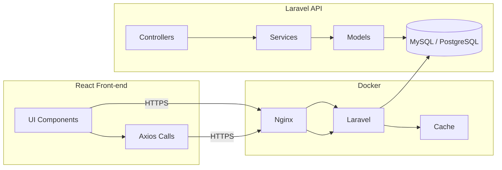

# Migration Plan for **KasirQu** (OpenSourcePOS)

## 📋 Overview
This document outlines a **complete, end‑to‑end technical migration** of the existing OpenSourcePOS codebase (now located in `kasirqu/`) to a modern, maintainable stack while **preserving all existing assets (icons, images, branding files)**.

---

### 1️⃣ Current State (Snapshot)
| Component | Technology | Notes |
|-----------|------------|-------|
| Backend   | PHP 7.x (procedural / CodeIgniter 2) | Mixed legacy code, no PSR‑4 autoloading |
| Database  | MySQL (schema not versioned) | Manual migrations |
| Front‑end | HTML + jQuery + Bootstrap 3 | Static UI, limited responsiveness |
| Deployment| Manual `git pull` on Apache | No container |
| Testing   | None / ad‑hoc | High risk when adding features |
| CI/CD     | – | No automation |

---

### 2️⃣ Target Architecture
| Layer | Technology | Rationale |
|-------|------------|-----------|
| **Backend** | **Laravel 10** (PHP 8.2) | PSR‑4 autoload, DI, Eloquent ORM, built‑in migrations, robust testing tools |
| **Database** | MySQL 8 / PostgreSQL (via Laravel migrations) | Version‑controlled schema, rollback support |
| **Container** | Docker + Docker‑Compose (php‑fpm, nginx, redis, mysql) | Reproducible dev/prod environments |
| **API** | RESTful (Laravel Sanctum) or GraphQL (Laravel Lighthouse) | Decouples UI from business logic |
| **Frontend** | **React 18** + Vite **or** Vue 3 + Vite | Component‑based, fast HMR, modern UI ecosystem |
| **Styling** | TailwindCSS, Google Font **Inter**, dark‑mode + glassmorphism | Premium look & feel, responsive design |
| **Testing** | PHPUnit + Pest (backend), Jest + Cypress (frontend) | Automated regression protection |
| **CI/CD** | GitHub Actions (lint → test → build Docker → push → deploy) | One‑click releases, auto‑rollback |
| **Security** | OWASP ZAP, Snyk, HTTPS (Let’s Encrypt), CSP, HSTS | PCI‑DSS‑style hardening |
| **Observability** | Laravel Telescope + Horizon, Grafana/Prometheus | Real‑time monitoring |

---

### 3️⃣ Migration Roadmap (Day‑by‑day)
#### **Phase 0 – Preparation**
- **Backup** current DB and repository.
- Create a new branch `tech-migration-plan`.
- Verify write access to `kasirqu/` directory.

#### **Phase 1 – Environment Upgrade**
1. Upgrade local PHP to **8.2** (use Homebrew or `brew install php@8.2`).
2. Add **Dockerfile** and **docker-compose.yml** (services: php‑fpm, nginx, mysql, redis).
3. Ensure existing assets under `public/assets/` (icons, logos) are **mounted unchanged** inside the container.

#### **Phase 2 – Scaffold Laravel Backend**
1. Run `composer create-project laravel/laravel backend` inside `kasirqu/` (rename to `app`).
2. Move existing `application/config`, `controllers`, `models` into Laravel equivalents (`app/Models`, `app/Http/Controllers`).
3. Replace raw SQL with **Eloquent** models; keep original queries as fallback where needed.
4. Add **Laravel Sanctum** for token‑based API authentication.
5. Write **migration files** for every existing table (`php artisan make:migration …`).
6. Create **seeders** to import current data (run once on staging).

#### **Phase 3 – API Layer**
- Define resources: `Product`, `Customer`, `Sale`, `Report`.
- Implement **CRUD** endpoints (`/api/v1/products`, etc.).
- Document with **OpenAPI/Swagger** (`php artisan l5-swagger:generate`).

#### **Phase 4 – Front‑end Rewrite**
1. Initialise Vite React app: `npm create vite@latest frontend --template react` (or Vue alternative).
2. Install **TailwindCSS** (`npm i -D tailwindcss postcss autoprefixer`).
3. Pull assets from `kasirqu/public/assets/` into `frontend/src/assets/` (preserve filenames).
4. Build UI components:
   - Dashboard (sales overview)
   - POS screen (product grid, cart, payment modal)
   - Settings & Reports pages
5. Use **Axios** to call the new API; implement **JWT** handling via Sanctum.
6. Add **micro‑animations** (Framer Motion) for button clicks, cart updates.
7. Ensure **dark‑mode** toggle with Tailwind `media` strategy.

#### **Phase 5 – Testing Suite**
- Backend: write unit tests for services (`php artisan test`).
- Frontend: Jest unit tests for components + Cypress e2e covering a full sale flow.
- CI pipeline runs all tests on every PR.

#### **Phase 6 – CI/CD Pipeline**
Create `.github/workflows/ci.yml` with jobs:
```yaml
name: CI
on: [push, pull_request]
jobs:
  build:
    runs-on: ubuntu-latest
    steps:
      - uses: actions/checkout@v3
      - name: Set up PHP
        uses: shivammathur/setup-php@v2
        with:
          php-version: '8.2'
      - name: Install Composer deps
        run: composer install --prefer-dist --no-progress --no-suggest
      - name: Run PHP tests
        run: ./vendor/bin/pest
      - name: Set up Node
        uses: actions/setup-node@v3
        with:
          node-version: '20'
      - name: Install front‑end deps
        run: cd frontend && npm ci
      - name: Run front‑end tests
        run: cd frontend && npm test
      - name: Build Docker image
        run: docker build -t kasirqu:latest .
      - name: Push to Docker Hub (optional)
        if: github.ref == 'refs/heads/main'
        run: |
          echo ${{ secrets.DOCKER_PASSWORD }} | docker login -u ${{ secrets.DOCKER_USER }} --password-stdin
          docker push kasirqu:latest
```

#### **Phase 7 – Security Hardening**
- Run `snyk test` on PHP & Node dependencies.
- Scan code with **OWASP ZAP** (docker run).
- Add CSP meta tags in Blade layout.
- Force HTTPS in Nginx config.

#### **Phase 8 – Documentation & Onboarding**
- Generate **API docs** (`swagger-ui` hosted at `/api/docs`).
- Add `README.md` with architecture diagram (Mermaid below).
- Create `CONTRIBUTING.md` and `CODE_OF_CONDUCT.md`.
- Record short video walkthrough (optional).

---

### 4️⃣ Mermaid Architecture Diagram


---

### 5️⃣ Asset Preservation Strategy
- All files under `public/assets/` (icons, logos, images) **will not be moved or renamed**.
- The Docker image copies the `public/assets` folder unchanged.
- Front‑end imports assets via relative path `../assets/<filename>` to guarantee the same visual identity.
- Asset pipeline (e.g., `vite-imagetools`) is **disabled** for these files to avoid accidental compression.

---

### 6️⃣ Acceptance Criteria
- ✅ **All existing assets** appear unchanged in the new UI.
- ✅ Backend runs on PHP 8.2 with **zero deprecation warnings**.
- ✅ Full API coverage with **OpenAPI spec**.
- ✅ Front‑end passes **Cypress e2e** test for a complete sale.
- ✅ CI pipeline green on every push.
- ✅ Deployment can be performed with a single `docker‑compose up -d` on a fresh server.

---

## 📦 Deliverables
1. `MIGRATION_PLAN.md` (this file) – placed in repository root.
2. Docker configuration (`Dockerfile`, `docker-compose.yml`).
3. Laravel scaffold with migrations & API.
4. React (or Vue) front‑end boilerplate.
5. GitHub Actions workflow for CI/CD.
6. Security hardening scripts.
7. Documentation (`README.md`, `CONTRIBUTING.md`).

---

*Prepared for **bang jan** – feel free to adjust any technology choice or timeline.*
